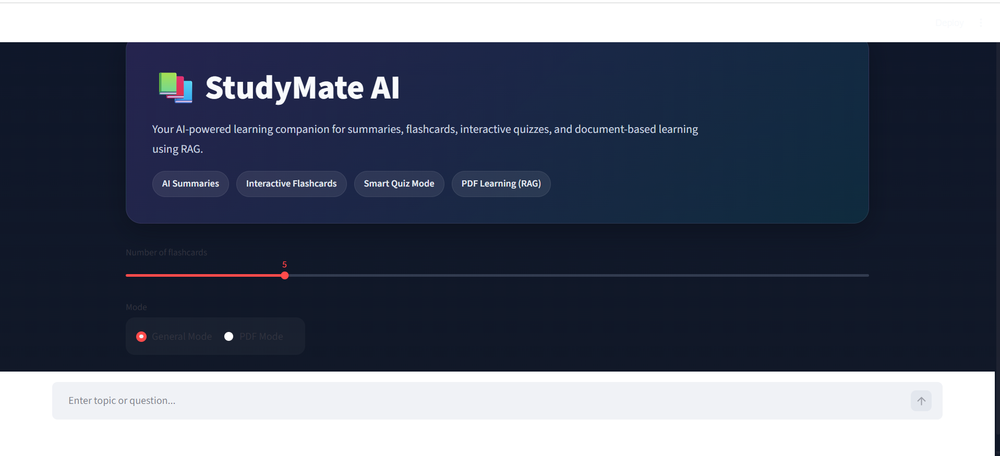
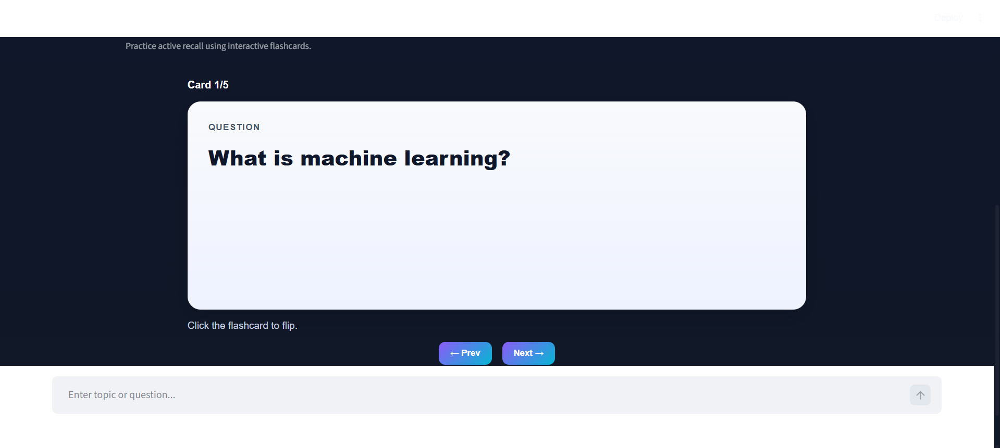
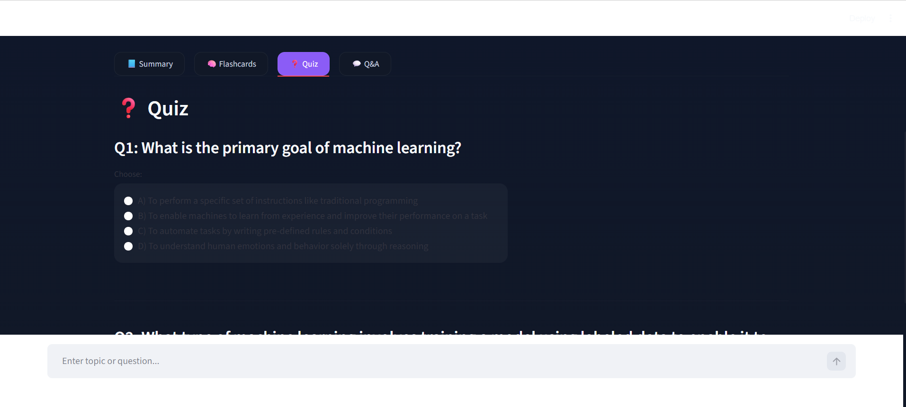
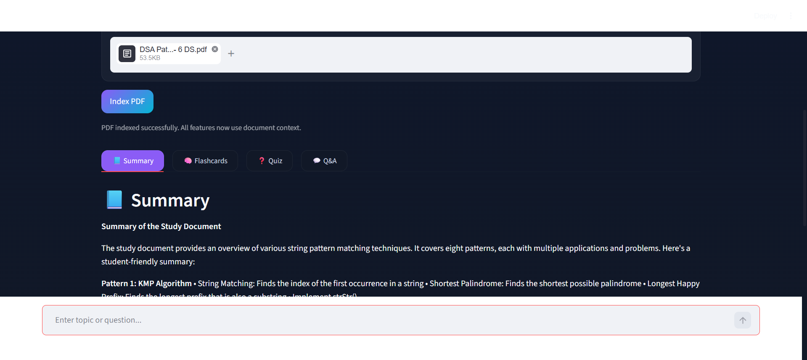

# StudyMate AI 📚

An AI-powered learning assistant that helps students learn faster using:
- Smart summaries
- Interactive flashcards
- AI-generated quizzes
- PDF-based learning with RAG (Retrieval-Augmented Generation)

Built using Streamlit, Groq LLMs, and lightweight vector retrieval.

---

# 🚀 Features

## 📘 AI Summaries
Generate easy-to-understand summaries for any topic.

## 🧠 Interactive Flashcards
- Flip-card animations
- Previous/Next navigation
- Adjustable number of flashcards
- Active recall learning experience

## ❓ Smart Quiz Mode
- AI-generated MCQs
- Instant scoring
- Retry quiz functionality
- Explanations for correct and wrong answers

## 📄 PDF Learning (RAG)
Upload PDFs and:
- Ask follow-up questions
- Generate summaries
- Create flashcards from documents
- Generate quizzes from uploaded material

## 🎨 Modern UI
- Dark-themed futuristic interface
- Responsive layout
- Smooth user experience
- Student-focused design

---

# 🛠️ Tech Stack

## Frontend
- Streamlit
- Custom CSS

## Backend Logic
- Python

## AI/LLM
- Groq API
- Llama Models

## RAG Pipeline
- TF-IDF Vectorization
- Cosine Similarity Retrieval
- PDF Parsing using PyPDF

---

# 📂 Project Structure

```bash
studymate-ai/
│
├── backend/
│   ├── core/
│   ├── models/
│   ├── services/
│   └── utils/
│
├── frontend/
│   ├── components/
│   └── styles/
│
├── app.py
├── requirements.txt
├── Dockerfile
└── README.md
```

---

# ⚙️ Installation

## 1️⃣ Clone Repository

```bash
git clone https://github.com/sandhyasharma24/studymate.ai.git

cd studymate.ai
```

## 2️⃣ Create Virtual Environment

### Windows

```bash
python -m venv venv

venv\Scripts\activate
```

### Linux/Mac

```bash
python3 -m venv venv

source venv/bin/activate
```

## 3️⃣ Install Dependencies

```bash
pip install -r requirements.txt
```

## 4️⃣ Add Environment Variables

Create a `.env` file:

```env
GROQ_API_KEY=your_groq_api_key
```

## 5️⃣ Run Application

```bash
streamlit run app.py
```

---

# 🧠 How RAG Works

1. User uploads PDF  
2. PDF text is extracted  
3. Text is split into chunks  
4. TF-IDF vectorization is applied  
5. Relevant chunks are retrieved using cosine similarity  
6. Retrieved context is sent to the LLM for grounded responses  

---

# 📸 Screenshots

## Home Interface



## Flashcards



## Quiz Mode



## PDF Learning



---

# 🔥 Future Improvements

- Persistent vector database
- Chat history memory
- Web search integration
- Voice input support
- Multi-document learning
- Authentication system
- Export notes/flashcards

---

# 👩‍💻 Author

Sandhya Sharma

GitHub: https://github.com/sandhyasharma24

---

# ⭐ If you like this project

Give it a star on GitHub 😄