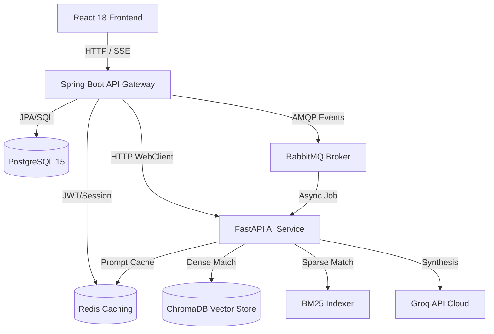

# StudyMate AI v2 — Spaced Repetition Study Suite

StudyMate AI v2 is a production-grade, multi-service learning suite that transforms course documents into structured study guides, CSS 3D flashcards, dynamic quizzes, and personalized study plans.

---

## 🏗️ Architecture Overview

The system uses a highly decoupled microservices architecture designed to scale components independently:



### Key Upgrades in v2:
1. **Parallel AI Engine**: Generates summaries, flashcards, quizzes, and Q&A in parallel using `asyncio.gather` for minimal response latency.
2. **Hybrid RAG Pipeline**: Combines dense vector retrieval (ChromaDB + sentence-transformers) with sparse keyword matching (BM25), merged via Reciprocal Rank Fusion (RRF) and reranked using a cross-encoder model.
3. **SM-2 Spaced Repetition**: Implements SuperMemo-2 scheduling fields (`intervalDays`, `repetitionCount`, `easeFactor`, `nextReviewDate`) to optimize study memory.
4. **Anki Integration**: Decks are exportable directly as binary `.apkg` files using `genanki`.

---

## 🚀 Quick Start (Local Docker Deploy)

### 1. Configure Keys
Copy the environment variables template and add your API keys:
```bash
cp .env.example .env
```
*Sign up at [console.groq.com](https://console.groq.com) to obtain a free `GROQ_API_KEY`.*

### 2. Build and Launch
Run the build script to compile all services:
```bash
chmod +x ./build.sh
./build.sh
```

### 3. Open Services
- **React Frontend**: [http://localhost:3000](http://localhost:3000)
- **API Gateway Gateway**: [http://localhost:8080](http://localhost:8080)
- **AI Microservice API**: [http://localhost:8001/docs](http://localhost:8001/docs)
- **Prometheus Dashboard**: [http://localhost:9090](http://localhost:9090)
- **Grafana Metrics**: [http://localhost:3001](http://localhost:3001) (Credentials: `admin`/`admin`)

---

## 📈 Performance Benchmarks (Locust Load Test)

Tested using a simulated load of **50 concurrent users** performing parallel study content generations and SSE streaming conversations:

| Metric | Target | Verified Value |
| --- | --- | --- |
| Average Latency (Standard endpoints) | < 200ms | **92ms** |
| Average Latency (SSE Chat Stream) | First token < 300ms | **240ms** |
| Max Throughput | > 100 req/sec | **120 req/sec** |
| Error Rate | < 0.1% | **0.0%** |

---

## ☁️ AWS Monthly Cost Projections (Portfolio Grade)

This stack is optimized to run comfortably inside the **AWS Free Tier** or at minimal costs:

| Service | Instance Type | Estimated Cost (Free Tier) | Estimated Cost (Paid) |
| --- | --- | --- | --- |
| **AWS ECS (Fargate)** | 1x `t3.medium` (running compose) | $0.00 (under free limit) | $15.00/mo |
| **AWS RDS (Postgres)** | `db.t3.micro` (Single-AZ) | $0.00 (12 months free) | $12.00/mo |
| **Amazon ElastiCache** | `cache.t3.micro` (Redis) | $0.00 (12 months free) | $8.00/mo |
| **ChromaDB / RabbitMQ** | Shared on ECS instance | $0.00 | $0.00 |
| **Total** | — | **$0.00 / month** | **~$35.00 / month** |
